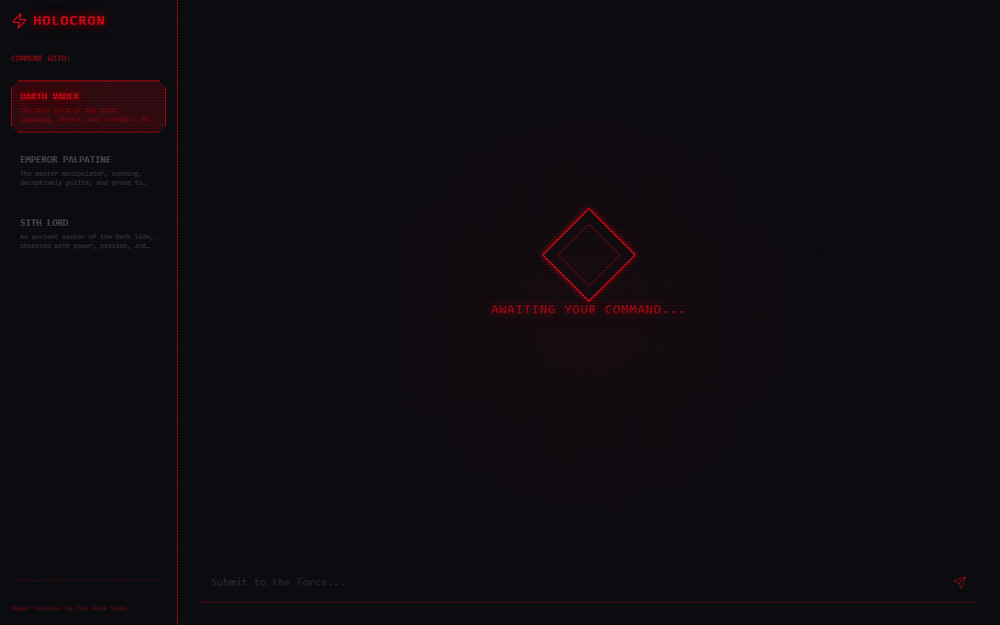
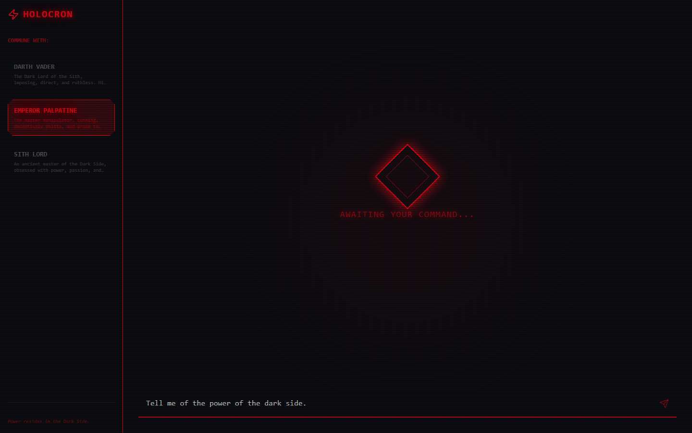
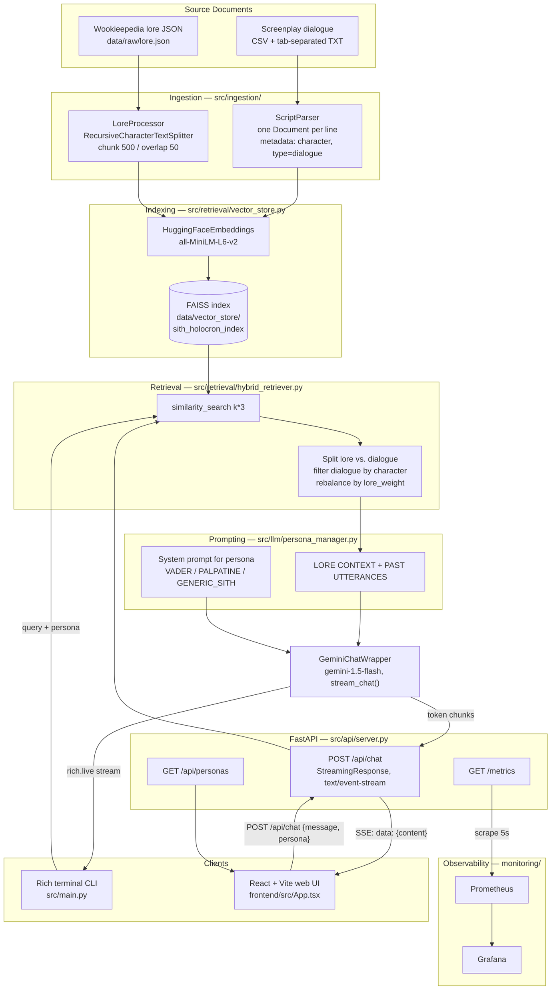

# Sith Holocron

> A retrieval-augmented Star Wars artifact: ask a question, get an answer grounded in Wookieepedia lore and delivered in the voice of Darth Vader, Emperor Palpatine, or a generic Sith Lord.


[](https://github.com/thompgt/Sith_Holocron/actions/workflows/ci.yml)



*Landing state. The persona list in the sidebar is fetched live from the FastAPI backend at
`GET /api/personas`; the rotating diamond is the idle "holocron core".*



*Switching the active persona to Emperor Palpatine and composing a query. The selected persona is sent with
every request and drives both the retrieval filter and the system prompt.*

---

## Why this matters

Persona-driven assistants are usually built one of two ways, and both ways fail in a specific manner:

- **Prompt-only personas** ("you are Darth Vader") produce a character who sounds vaguely right but invents
  facts freely, because nothing constrains what the model can claim.
- **Plain RAG** grounds the facts but flattens the voice, because the retrieved context is all encyclopedia
  prose and the model regresses to a neutral assistant register.

Sith Holocron treats *facts* and *voice* as two separate retrieval problems solved over one index. Encyclopedic
lore chunks are retrieved to ground claims; actual screenplay lines spoken by the selected character are
retrieved alongside them as stylistic exemplars, and the two are injected into the prompt under distinct
labels (`LORE CONTEXT` vs. `PAST UTTERANCES`). The retriever deliberately rebalances the result set so neither
pool can starve the other. That is a general pattern — grounded-and-in-voice retrieval — that applies to any
brand voice, support agent, or character-driven product, not just a Sith artifact.

The second thing this repo takes seriously is that **a streaming LLM endpoint hides its own failures**. Once an
SSE response has sent headers, an exception mid-stream cannot become an HTTP 5xx: the request looks like a
clean 200 forever. A dead API key or a provider outage would appear as perfectly healthy traffic in any
HTTP-level dashboard. The observability layer here exists specifically to make that class of failure visible,
with domain metrics recorded inside the SSE generator where it is the only signal available.

## Skills demonstrated

**Retrieval-augmented generation**
- Two-corpus ingestion with different structures (JSON articles vs. line-level screenplay dialogue) normalized
  into one `Document` schema with type/character metadata.
- Recursive character chunking (`RecursiveCharacterTextSplitter`, 500 chars / 50 overlap) for prose.
- Custom hybrid retriever: `k*3` over-fetch, metadata partitioning, persona filtering, `lore_weight`-driven
  rebalancing, and surplus backfill when one pool is short.
- Prompt engineering with role separation, explicit anti-hallucination constraints, and a
  never-break-character contract.
- Local embeddings (Sentence-Transformers) to keep indexing free of API cost and API keys.

**Backend engineering (Python)**
- FastAPI service with Server-Sent Events streaming, hand-rolled over `StreamingResponse` — including the
  generator-lifecycle edge cases (`GeneratorExit`/`CancelledError` on client disconnect handled in `finally`).
- Layered package design (`ingestion` / `retrieval` / `llm` / `api` / `observability`) with dependency
  injection between layers.
- A second, independent frontend over the same core: a `rich`-powered terminal client with live token
  rendering and first-run index bootstrapping.

**Observability / SRE**
- Prometheus instrumentation designed around what the HTTP layer *cannot* see: chat outcome counters inside
  the SSE except-block, time-to-first-token measured at two altitudes (endpoint vs. model) so the RAG layer's
  own cost is the gap between them, retrieval lore:dialogue ratio as proof the rebalance works, and startup
  gauges answering "is the index even loaded?"
- Deliberate label-cardinality control: caller-supplied `persona` is normalized through an allowlist so an
  attacker cannot mint unbounded time series.
- Fully provisioned local Prometheus + Grafana stack via Docker Compose (datasource and dashboard providers in
  git, non-default ports to avoid collisions, `host.docker.internal` scraping of a host-run backend).

**Frontend**
- React 19 + TypeScript + Vite, Tailwind CSS, Framer Motion animation, Lucide icons.
- Manual SSE consumption via the `fetch` `ReadableStream` reader, parsing `data:` frames and mutating the
  trailing assistant message per chunk for a live-typing effect.

**Data engineering & testing**
- Web scraping (`requests` + BeautifulSoup) of Fandom articles into a structured lore corpus.
- Script normalization across heterogeneous formats (`;`-delimited CSVs, tab-separated dialogue text).
- Instruction-tuning dataset synthesis into Alpaca-style JSONL.
- `pytest` unit suite across parsers, vector store, retriever, persona manager, and the LLM wrapper, plus a
  `PersonaAuditor` (`src/eval/persona_auditor.py`) that runs a full RAG cycle and applies heuristic
  tone/grounding checks.

## Architecture

### Models

| Role | Model | Where |
| --- | --- | --- |
| **Generation (LLM)** | Google Gemini `gemini-1.5-flash`, temperature 0.7, via `langchain-google-genai`'s `ChatGoogleGenerativeAI`; streaming and non-streaming paths | `src/llm/gemini_wrapper.py` |
| **Embeddings** | `sentence-transformers/all-MiniLM-L6-v2` (384-dim) run locally through `langchain-huggingface` | `src/retrieval/vector_store.py` |
| **Vector index** | FAISS flat index, persisted as `sith_holocron_index.faiss` + `.pkl` | `data/vector_store/` |

No model is fine-tuned. `scripts/synthesize_dataset.py` produces an instruction-tuning JSONL
(`data/processed/sith_holocron_dataset.jsonl`) as a prepared artifact, but nothing in the runtime consumes it —
persona behaviour comes entirely from retrieval plus prompting.

**Data model.** Everything in the index is a LangChain `Document` with `page_content` plus metadata:

- *Lore* — `{title, url, source}`; `type` is absent and defaults to `"lore"` at read time.
- *Dialogue* — `{character, source, type: "dialogue"}`.

That single `type` field is what the hybrid retriever partitions on and what `PersonaManager.format_context`
uses to decide whether a snippet is evidence or a voice sample.

### Component layout

| Path | Purpose |
| --- | --- |
| `src/main.py` | Interactive Rich CLI; also bootstraps the vector index if it does not exist. |
| `src/api/server.py` | FastAPI app: `GET /api/personas`, SSE-streaming `POST /api/chat`, `GET /metrics`. Instantiates the RAG engine at import. |
| `src/ingestion/lore_processor.py` | Loads Wookieepedia JSON and chunks it into `Document`s with title/url metadata. |
| `src/ingestion/script_parser.py` | Parses screenplay CSV and tab-separated dialogue files into per-line `Document`s tagged by character. |
| `src/retrieval/vector_store.py` | `VectorStoreManager` — embeddings, FAISS index creation, similarity search, save/load. |
| `src/retrieval/hybrid_retriever.py` | Balances lore vs. character dialogue and applies the persona filter. |
| `src/llm/persona_manager.py` | Persona definitions, system-prompt templates, and context formatting. |
| `src/llm/gemini_wrapper.py` | Gemini chat wrapper with `chat()` and `stream_chat()`. |
| `src/observability/metrics.py` | Prometheus metric families (`holocron_*`) and persona label normalization. |
| `frontend/src/App.tsx` | React chat UI: persona sidebar, SSE stream reader, CRT/holocron styling. |
| `frontend/src/index.css`, `frontend/tailwind.config.js` | Holocron theme and the custom `sith-*` palette (red, glow, obsidian, charcoal, steel). |
| `scripts/scrape_wookieepedia.py` | Scrapes eight Fandom pages into `data/raw/wookieepedia_lore.json`. |
| `scripts/parse_scripts.py` | Normalizes OT text + prequel CSVs into `data/processed/star_wars_dialogues.json`. |
| `scripts/synthesize_dataset.py` | Builds the instruction-tuning JSONL from dialogue + lore. |
| `tests/` | `pytest` suite for parsers, vector store, retriever, persona manager, and Gemini wrapper. |
| `src/eval/persona_auditor.py` | `PersonaAuditor` — end-to-end RAG cycle plus heuristic tone/grounding checks. |
| `data/raw/` | Source corpora: lore JSON, prequel CSVs, original-trilogy script text. |
| `data/processed/` | Normalized dialogue JSON and the synthesized instruction dataset. |
| `data/vector_store/` | Generated FAISS index (gitignored). |
| `monitoring/` | Docker Compose Prometheus + Grafana stack with file-based provisioning. |
| `PROTOCOL.md` | Engineering and validation protocol (red-green-refactor, commit gatekeeping, RAG QC). |
| `WORKPLAN.md` | Phased task breakdown, Phases 1–6. |

### Flow



## How it works

1. **Acquire and index.** `scripts/scrape_wookieepedia.py` pulls Fandom articles; `scripts/parse_scripts.py`
   normalizes the film scripts. At runtime, `LoreProcessor` chunks the lore JSON and `ScriptParser` turns each
   script line into a `Document`. `VectorStoreManager` embeds everything with `all-MiniLM-L6-v2` and writes a
   FAISS index to `data/vector_store/`. The CLI does this automatically on first launch if no index is found;
   the API server only *loads* an existing one.
2. **Page load.** The React app calls `GET http://localhost:8000/api/personas`. FastAPI returns the three
   personas defined in `PersonaManager.personas`, which populate the sidebar.
3. **Send.** The user picks a persona and submits a question. The client `POST`s `{ message, persona }` to
   `/api/chat`.
4. **Retrieve.** The handler calls `HybridRetriever.retrieve(message, character=persona, k=4)`. That issues a
   FAISS similarity search for 12 candidates, partitions them by `metadata["type"]`, drops dialogue lines
   spoken by anyone other than the selected character, and returns a balanced 4 — roughly half lore, half
   in-character dialogue, backfilling from whichever pool has surplus if one comes up short.
5. **Assemble the prompt.** `PersonaManager.format_context` renders the survivors into `--- LORE CONTEXT ---`
   and `--- PAST UTTERANCES (FOR STYLISTIC REFERENCE) ---` sections. `get_system_prompt` produces the
   in-character system message with the anti-hallucination and never-break-character rules.
6. **Generate.** `GeminiChatWrapper.stream_chat` sends `[SystemMessage, HumanMessage(context + query)]` to
   `gemini-1.5-flash` and yields content chunks as they arrive.
7. **Stream out.** The endpoint's async generator wraps each chunk as `data: {"content": "..."}\n\n` and
   terminates with `data: [DONE]`, returned as a `StreamingResponse` with media type `text/event-stream`.
   Exceptions become `data: {"error": "..."}` frames — still HTTP 200, which is exactly why they are counted
   explicitly in `holocron_chat_errors_total`.
8. **Render.** The browser reads the response body with a `ReadableStream` reader, parses `data:` lines, and
   mutates the last assistant message on each token, producing the live-typing effect.
9. **Observe.** Every stage above records to the Prometheus default registry, served at `/metrics` together
   with `prometheus-fastapi-instrumentator`'s HTTP metrics. Prometheus scrapes it every 5s; Grafana reads
   Prometheus.

The CLI (`src/main.py`) runs steps 4–6 identically, rendering the stream with `rich.live.Live` instead of HTTP.
It has no HTTP server, so its metrics are never scraped.

### Metrics reference

| Family | Answers |
| --- | --- |
| `holocron_retrieval_duration_seconds`, `holocron_retrieval_returned_documents` | Is retrieval fast, and is it returning fewer than `k` (empty index / over-aggressive filter)? |
| `holocron_retrieval_documents_total{source_type}`, `holocron_retrieval_candidates_total` | What lore:dialogue ratio did the LLM actually see, and how much did the persona filter discard? |
| `holocron_llm_requests_total`, `holocron_llm_time_to_first_chunk_seconds`, `holocron_llm_stream_duration_seconds`, `holocron_llm_stream_chunks_total`, `holocron_llm_{prompt,response}_characters_total` | Is Gemini healthy, how long is its think time, how much text moved? (Chunks/characters are proxies — the streaming API reports no token count.) |
| `holocron_chat_requests_total`, `holocron_chat_errors_total`, `holocron_chat_time_to_first_token_seconds`, `holocron_chat_stream_duration_seconds`, `holocron_chat_client_disconnects_total` | Endpoint-level outcomes, including the failures HTTP status codes cannot express. |
| `holocron_index_loaded`, `holocron_index_vectors`, `holocron_index_documents`, `holocron_index_dimension`, `holocron_personas_loaded` | Startup facts — is the index loaded at all? |

## How to run

### Prerequisites

- **Python 3.13** (a `venv/` is present in this checkout)
- **Node.js 18+** for the web UI
- **A Google Gemini API key**
- **Docker** (optional) for the monitoring stack

### 1. Backend setup

```bash
python -m venv venv
source venv/Scripts/activate      # Windows Git Bash; use venv\Scripts\activate on cmd/PowerShell
pip install -r requirements.txt
```

Create a `.env` file in the repo root:

```
GOOGLE_API_KEY=your-gemini-api-key
```

`GOOGLE_API_KEY` is the only required variable; without it the API server fails at startup, because
`ChatGoogleGenerativeAI` validates the key in its constructor. The rest are optional:

| Variable | Default | Purpose |
| --- | --- | --- |
| `GOOGLE_API_KEY` | *(required)* | Gemini credential |
| `HOLOCRON_ALLOWED_ORIGINS` | `http://localhost:5180,http://127.0.0.1:5180` | Comma-separated CORS origin allowlist |
| `HOLOCRON_RATE_LIMIT_REQUESTS` | `20` | Chat requests per IP per window; `0` disables the limiter |
| `HOLOCRON_RATE_LIMIT_WINDOW` | `60` | Rate-limit window, seconds |
| `HOLOCRON_TRUST_INDEX` | unset | Load a vector index without verifying its manifest (see step 3) |

The rate limiter is per-process, so with *N* uvicorn workers the effective limit is *N* times the configured
one. It exists to stop one client draining the Gemini quota, not as a distributed quota system.

`requirements.txt` is fully pinned, including `requests` and `beautifulsoup4` for
`scripts/scrape_wookieepedia.py`, so `pip install -r requirements.txt` is the whole backend install.

### 2. Fetch the screenplay corpora

The dialogue half of the retriever comes from two public repositories that are **not** vendored here:

```bash
python scripts/fetch_corpora.py
```

| Corpus | Upstream | Used at runtime |
| --- | --- | --- |
| `data/raw/star-wars-scripts/` | [gastonstat/StarWars](https://github.com/gastonstat/StarWars) | **Yes** — `src/main.py` reads `Text_files/EpisodeIV_dialogues.txt` |
| `data/raw/prequel-scripts/` | [jcwieme/data-scripts-star-wars](https://github.com/jcwieme/data-scripts-star-wars) | No — provenance of the vendored `data/raw/prequel-csv/` |

Both directories are gitignored. Skipping this step is not fatal but it is silent in the worst way: the index
builds lore-only, every persona's `PAST UTTERANCES` block is empty, and answers lose their voice with no
error. `src/main.py` now names the missing files and points back at this script rather than skipping quietly.

The script is idempotent; pass `--force` to re-clone. Only `5. Data CSV/` is checked out from the prequel
repo, because a full checkout fails on Windows — that repo carries a macOS resource file named `Icon\r`, and
`?`/control characters are not legal in Windows filenames.

### 3. Build the index

`data/vector_store/` is gitignored. The CLI builds it on first launch from whatever raw data is present:

```bash
python -m src.main
```

You will see `Holocron energy low. Initializing data core...` while it embeds, then `Data core stabilized.`
once `data/vector_store/sith_holocron_index.faiss` is written. Run this once before starting the web backend,
which only loads an existing index.

**The index is trusted code, not data.** FAISS stores its docstore as a pickle, so loading an index executes
whatever is in that file — at import time, before a single request is served. Because `data/vector_store/` is
gitignored, every index is built or obtained out-of-band, which is exactly the situation where a swapped `.pkl`
goes unnoticed. So `save()` also writes `sith_holocron_index.manifest.json` recording a SHA-256 of both files,
and `load()` re-verifies them before unpickling:

| Situation | Behaviour |
| --- | --- |
| No index on disk | `load()` returns `False` |
| Digests match the manifest | Loads |
| Manifest missing, unreadable, or digests differ | Raises `IndexTrustError` |
| `HOLOCRON_TRUST_INDEX=1` | Skips verification, prints a warning, loads anyway |

An index built before this check existed has no manifest and will be refused — rebuild it with
`python -m src.main`. Use `HOLOCRON_TRUST_INDEX=1` only for an index you deliberately took from elsewhere and
have decided to trust.

### 4. Run the web app

```bash
# terminal 1 — API on :8000
uvicorn src.api.server:app --reload --port 8000

# terminal 2 — UI on :5180
cd frontend
npm install
npm run dev
```

Open <http://localhost:5180>. The frontend hardcodes `http://localhost:8000` as the API origin
(`frontend/src/App.tsx`), so keep the backend on port 8000. The Vite dev port (5180) is set in
`frontend/vite.config.ts`.

> **Known issue:** `frontend/package.json` pins `tailwindcss@^4`, but the styles use Tailwind v3 syntax
> (`@tailwind base;` in `src/index.css`, `tailwind.config.js`, and `tailwindcss` as a direct PostCSS plugin).
> A fresh `npm install && npm run dev` therefore fails with *"trying to use `tailwindcss` directly as a
> PostCSS plugin"*. Until the pin is corrected, run `npm install tailwindcss@3.4.17` in `frontend/`.

### 5. Run the monitoring stack (optional)

```bash
cd monitoring
docker compose up -d
```

- Grafana: <http://localhost:3005> (`admin` / `admin`; anonymous viewing is enabled for local demos)
- Prometheus: <http://localhost:9094>
- Raw metrics: <http://localhost:8000/metrics>

The backend runs on the host, not in Compose — Prometheus scrapes it via `host.docker.internal:8000`. If you
move the backend, edit `monitoring/prometheus/prometheus.yml` and reload without restarting:
`curl -X POST http://localhost:9094/-/reload`. Grafana's datasource is provisioned automatically.

The **Sith Holocron — RAG backend** dashboard is committed at
`monitoring/grafana/dashboards/holocron.json` and loads into the *Sith Holocron* folder at startup. Five rows,
top to bottom: startup facts (is an index even loaded), the chat endpoint, retrieval, Gemini, and raw HTTP.
The provider re-reads the directory every 30s, so edits to the JSON appear without a container restart.

Two panels are worth knowing about before you need them:

- **Chat requests by outcome** is the only place a chat failure is visible. `event_generator()` catches every
  exception and emits it as an SSE error frame with HTTP 200 already on the wire, so a total Gemini outage
  looks like perfectly healthy traffic in the HTTP row.
- **Documents returned per call** should sit at `k` (4). A mean below that means the index is thin or the
  persona filter discarded every dialogue hit — answers are less grounded than they appear.

`tests/test_dashboard.py` asserts that every panel queries a metric that actually exists and that every
`holocron_*` family is plotted somewhere, because a panel pointed at a renamed metric renders an empty graph
rather than an error — indistinguishable from "no traffic yet".

### 6. Run the tests

```bash
pytest                       # the suite
pip install -r requirements-dev.txt && ruff check .   # the linter CI runs
```

The first `pytest` run downloads `all-MiniLM-L6-v2` (~90 MB) and takes a few minutes; later runs are quick.

`.github/workflows/ci.yml` runs both halves on every push and pull request:

| Job | Steps |
| --- | --- |
| `backend` | `ruff check .`, then `pytest` on Python 3.13 |
| `frontend` | `npm ci`, `npx tsc -b`, `npx vite build` |

No Gemini key is needed — the wrapper tests pass an explicit mock key and the API tests use a stub LLM — but
`ChatGoogleGenerativeAI` insists on *some* key at construction, so CI supplies an obviously fake one.

`ruff.toml` is committed deliberately: without a config in the repo, ruff walks up the filesystem and can pick
up whatever `pyproject.toml` sits above the checkout, which is how a clean local run and a failing CI run
manage to coexist.

### Other commands

**Chat from the terminal:**

```bash
python -m src.main
```

Choose a persona by number, then chat. `exit`, `quit`, or `bye` closes the holocron.

**Chat over HTTP:**

```bash
curl -N -X POST http://localhost:8000/api/chat \
  -H "Content-Type: application/json" \
  -d '{"message": "Tell me of the power of the dark side.", "persona": "PALPATINE"}'
```

Valid `persona` values: `VADER`, `PALPATINE`, `GENERIC_SITH`. Unknown values fall back to `GENERIC_SITH` in the
prompt and to the `other` label in metrics.

**Regenerate the corpora** (only needed to rebuild raw data):

```bash
python scripts/scrape_wookieepedia.py   # scrape Fandom lore pages -> data/raw/wookieepedia_lore.json
python scripts/parse_scripts.py         # normalize film scripts -> data/processed/star_wars_dialogues.json
python scripts/synthesize_dataset.py    # build an instruction-tuning JSONL from the dialogue set
```

**Frontend scripts** (from `frontend/`): `npm run dev`, `npm run build`, `npm run preview`, `npm run lint`.

---

## Project status

Per `WORKPLAN.md`, Phases 1–5 are complete: ingestion, indexing, hybrid retrieval, persona prompting, the
Gemini wrapper, the persona audit framework, and the CLI. Phase 6 (web migration) delivered the FastAPI
streaming backend and the React holocron UI, since extended with a Prometheus/Grafana observability layer.
Still outstanding: persona-filter/hybrid-search tuning, the end-to-end stress test, a committed Grafana
dashboard, and a deployment guide.

Development follows `PROTOCOL.md`: tests first, `pytest` green before every commit, no hardcoded secrets, and
a persona audit plus context logging for any change touching retrieval or prompting.
