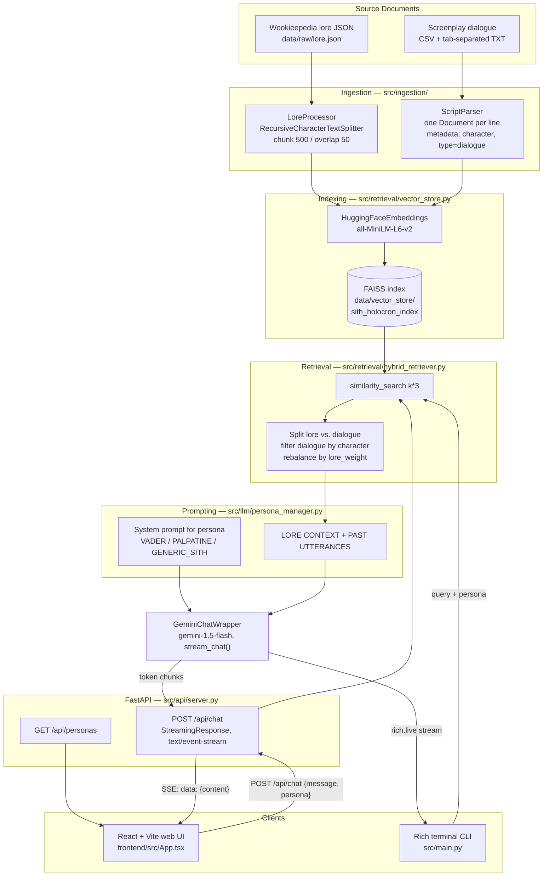

# Sith Holocron

> *"Power resides in the Dark Side."*

**Sith Holocron** is a Retrieval-Augmented Generation (RAG) system that lets you interrogate an interactive
Sith artifact. It indexes two very different corpora — factual Star Wars lore scraped from Wookieepedia and
raw screenplay dialogue from the films — into a single FAISS vector index, then answers your questions in the
voice of Darth Vader, Emperor Palpatine, or a generic Sith Lord. The retrieval layer is deliberately *hybrid*:
lore chunks supply the facts, character dialogue chunks supply the cadence and vocabulary, and both are
injected into a persona system prompt before a Gemini model streams its reply. There are two front ends — a
Rich-powered terminal CLI and a React/Vite web UI with a CRT-scanline "holocron" theme talking to a FastAPI
SSE endpoint.

---

## Screenshots


*Landing state. The persona list in the sidebar is fetched live from the FastAPI backend at
`GET /api/personas`; the rotating diamond is the idle "holocron core".*


*Switching the active persona to Emperor Palpatine and composing a query. The selected persona is sent with
every request and drives both the retrieval filter and the system prompt.*

---

## What it does

- **Ingests two source types.** `LoreProcessor` chunks Wookieepedia JSON articles with a recursive character
  splitter (500 chars, 50 overlap). `ScriptParser` reads screenplay CSVs and tab-separated dialogue text files
  into one `Document` per line, tagged with `character` and `type: "dialogue"`.
- **Embeds locally.** Sentence-Transformers `all-MiniLM-L6-v2` via `langchain-huggingface` — no embedding API
  cost, no key required for indexing.
- **Stores vectors in FAISS**, persisted to disk as `sith_holocron_index.faiss` / `.pkl`.
- **Retrieves hybridly.** `HybridRetriever` over-fetches (`k*3`), splits hits into lore vs. dialogue, filters
  dialogue down to the selected character, then rebalances to `k` results using a `lore_weight` (default 0.5),
  backfilling from whichever pool has surplus.
- **Builds a persona prompt.** `PersonaManager` renders a per-character system prompt with hard
  never-break-character constraints, and formats retrieved docs into two labelled blocks —
  `LORE CONTEXT` (grounding) and `PAST UTTERANCES` (style).
- **Streams the answer.** `GeminiChatWrapper` wraps `ChatGoogleGenerativeAI` (`gemini-1.5-flash`); the FastAPI
  route re-emits each chunk as a Server-Sent Event, and the React client appends tokens as they arrive.
- **Audits the persona.** `tests/persona_audit.py` runs a full RAG cycle and applies heuristic checks for
  character consistency and whether retrieved lore actually made it into the answer.

## Tech stack

- **Backend:** Python 3.13, LangChain (`langchain`, `langchain-community`, `langchain-google-genai`,
  `langchain-huggingface`), `faiss-cpu` for vector storage, `sentence-transformers` for embeddings,
  FastAPI + Uvicorn for the streaming API, `rich` for the CLI, `pandas` for script/CSV parsing,
  `pytest` for tests.
- **LLM:** Google Gemini `gemini-1.5-flash`, via `GOOGLE_API_KEY`. (`requirements.txt` also lists
  `langchain-openai` and `sse-starlette`, but neither is currently wired up — the SSE stream is hand-rolled
  with FastAPI's `StreamingResponse`.)
- **Frontend:** React 19, TypeScript, Vite, Tailwind CSS, Framer Motion, Lucide icons.

## Architecture



### Request lifecycle

1. **Page load.** The React app calls `GET http://localhost:8000/api/personas`. FastAPI returns the three
   personas defined in `PersonaManager.personas`, which populate the sidebar.
2. **Send.** The user picks a persona and submits a question. The client `POST`s
   `{ message, persona }` to `/api/chat`.
3. **Retrieve.** The handler calls `HybridRetriever.retrieve(message, character=persona, k=4)`. That issues a
   FAISS similarity search for 12 candidates, partitions them by `metadata["type"]`, drops dialogue lines
   spoken by anyone other than the selected character, and returns a balanced 4 — roughly half lore, half
   in-character dialogue.
4. **Assemble the prompt.** `PersonaManager.format_context` renders the survivors into `--- LORE CONTEXT ---`
   and `--- PAST UTTERANCES (FOR STYLISTIC REFERENCE) ---` sections. `get_system_prompt` produces the
   in-character system message with the anti-hallucination and never-break-character rules.
5. **Generate.** `GeminiChatWrapper.stream_chat` sends `[SystemMessage, HumanMessage(context + query)]` to
   `gemini-1.5-flash` and yields content chunks as they arrive.
6. **Stream out.** The endpoint's async generator wraps each chunk as `data: {"content": "..."}\n\n` and
   terminates with `data: [DONE]`, returned as a `StreamingResponse` with media type `text/event-stream`.
   Exceptions are surfaced as `data: {"error": "..."}`.
7. **Render.** The browser reads the response body with a `ReadableStream` reader, parses `data:` lines, and
   mutates the last assistant message on each token, producing the live-typing effect.

The CLI (`src/main.py`) runs steps 3–5 identically, rendering the stream with `rich.live.Live` instead of
HTTP. It also bootstraps the index on first run if `data/vector_store/` is missing.

---

## Quickstart

### Prerequisites

- Python 3.13 (a `venv/` is already present in this checkout)
- Node.js 18+ for the web UI
- A Google Gemini API key

### 1. Backend setup

```bash
python -m venv venv
source venv/Scripts/activate      # Windows Git Bash; use venv\Scripts\activate on cmd/PowerShell
pip install -r requirements.txt
```

Create a `.env` file in the repo root:

```
GOOGLE_API_KEY=your-gemini-api-key
```

Without this key the API server fails at import time — `ChatGoogleGenerativeAI` validates the key in its
constructor, and `src/api/server.py` instantiates the wrapper at module scope.

### 2. Build the index

The vector store lives at `data/vector_store/` and is **not** committed. The CLI builds it automatically on
first launch from whatever raw data is present:

```bash
python -m src.main
```

You will see `Holocron energy low. Initializing data core...` while it embeds, then
`Data core stabilized.` once `data/vector_store/sith_holocron_index.faiss` is written. The web backend only
*loads* an existing index, so run the CLI once before starting the server.

### 3. Run the web app

```bash
# terminal 1 — API on :8000
uvicorn src.api.server:app --reload --port 8000

# terminal 2 — UI on :5180
cd frontend
npm install
npm run dev
```

Open <http://localhost:5180>. The frontend hardcodes `http://localhost:8000` as the API origin, so keep the
backend on port 8000.

> **Known issue:** `frontend/package.json` pins `tailwindcss@^4`, but the styles use Tailwind v3 syntax
> (`@tailwind base;` in `src/index.css`, `tailwind.config.js`, and `tailwindcss` as a direct PostCSS plugin).
> A fresh `npm install && npm run dev` therefore fails with *"trying to use `tailwindcss` directly as a
> PostCSS plugin"*. Until the pin is corrected, run `npm install tailwindcss@3.4.17` in `frontend/`.

### 4. Run the tests

```bash
pytest
```

## Usage

**Terminal:**

```bash
python -m src.main
```

Choose a persona by number, then chat. `exit`, `quit`, or `bye` closes the holocron.

**HTTP:**

```bash
curl -N -X POST http://localhost:8000/api/chat \
  -H "Content-Type: application/json" \
  -d '{"message": "Tell me of the power of the dark side.", "persona": "PALPATINE"}'
```

Valid `persona` values: `VADER`, `PALPATINE`, `GENERIC_SITH`. Unknown values fall back to `GENERIC_SITH`.

**Data preparation helpers** (only needed to regenerate the raw corpora):

```bash
python scripts/scrape_wookieepedia.py   # scrape Fandom lore pages -> data/raw/wookieepedia_lore.json
python scripts/parse_scripts.py         # normalize film scripts -> data/processed/star_wars_dialogues.json
python scripts/synthesize_dataset.py    # build an instruction-tuning JSONL from the dialogue set
```

## Project structure

| Path | Purpose |
| --- | --- |
| `src/api/server.py` | FastAPI app: `/api/personas` and the SSE-streaming `/api/chat`. Instantiates the RAG engine at startup. |
| `src/main.py` | Interactive Rich CLI; also bootstraps the vector index if it does not exist. |
| `src/ingestion/lore_processor.py` | Loads Wookieepedia JSON and chunks it into `Document`s with title/url metadata. |
| `src/ingestion/script_parser.py` | Parses screenplay CSV and tab-separated dialogue files into per-line `Document`s tagged by character. |
| `src/retrieval/vector_store.py` | `VectorStoreManager` — embeddings, FAISS index creation, similarity search, save/load. |
| `src/retrieval/hybrid_retriever.py` | Balances lore vs. character dialogue and applies the persona filter. |
| `src/llm/persona_manager.py` | Persona definitions, system-prompt templates, and context formatting. |
| `src/llm/gemini_wrapper.py` | Gemini chat wrapper with `chat()` and `stream_chat()`. |
| `frontend/src/App.tsx` | React chat UI: persona sidebar, SSE stream reader, CRT/holocron styling. |
| `frontend/tailwind.config.js` | Custom `sith-*` palette (red, glow, obsidian, charcoal, steel). |
| `scripts/` | One-off data acquisition and preparation scripts. |
| `tests/` | `pytest` suite for parsers, vector store, retriever, persona manager, and Gemini wrapper. |
| `tests/persona_audit.py` | `PersonaAuditor` — end-to-end RAG cycle plus heuristic tone/grounding checks. |
| `data/raw/` | Source corpora: Wookieepedia lore JSON, prequel CSVs, original-trilogy script text. |
| `data/processed/` | Normalized dialogue JSON and the synthesized instruction dataset. |
| `PROTOCOL.md` | Engineering and validation protocol (red-green-refactor, commit gatekeeping, RAG QC). |
| `WORKPLAN.md` | Phased task breakdown, Phases 1–6. |

## Project status

Per `WORKPLAN.md`, Phases 1–5 are complete: ingestion, indexing, hybrid retrieval, persona prompting, the
Gemini wrapper, the persona audit framework, and the CLI. Phase 6 (web migration) delivered the FastAPI
streaming backend and the React holocron UI. Still outstanding: persona-filter/hybrid-search tuning, the
end-to-end stress test, and a deployment guide.

## Documents & conventions

Development follows `PROTOCOL.md`: tests first, `pytest` green before every commit, no hardcoded secrets, and
a persona audit plus context logging for any change touching retrieval or prompting.
